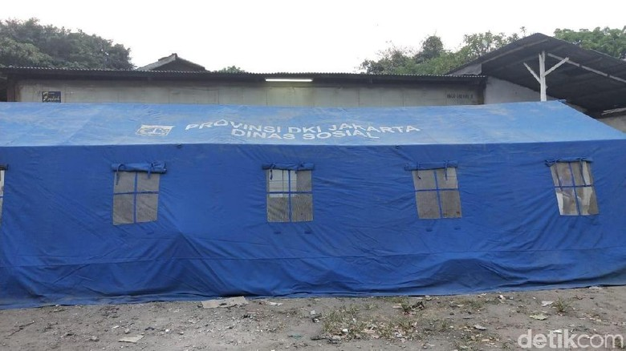

Dinas Sosial DKI Jakarta membangun tenda baru untuk warga RT 01 RW 08, Kelurahan Ancol, Pademangan, Jakarta Utara, yang rumahnya ambles. Tenda baru ini lebih layak dibanding tenda yang sebelumnya sudah didirikan.

Pantauan detikcom, tenda ini dibangun pada pukul 16.00 WIB. Tenda ini didirikan di lokasi yang sama dengan tenda sebelumnya, yakni di halaman PT Perikanan Nusantara (Persero) Cabang Jakarta, Jalan Lodan No 1, Pademangan, Ancol, Jakarta Utara.

Tenda dilengkapi dengan kipas anginTenda dilengkapi kipas angin. (M Guruh Nuary/detikcom)

"Ini langsung dari Dinas Sosial, dipasang tadi. (Diyakini lebih) nyaman, kita udah tambah kipas angin di dalam. Yang pasti lebih nyaman dari yang kemarin," kata Wakil Ketua Kampung Siaga Bencana (KSB) Kelurahan Ancol, Ammar, saat ditemui di lokasi, Selasa (20/11/2018).

Tenda ini berukuran 12x5 meter. Dengan luas yang lebih besar dari sebelumnya, tenda ini diperkirakan bisa menampung 50 orang.

Bantuan untuk warga juga datang. Bantuan tersebut di antaranya beras, biskuit, selimut, kaus, perlengkapan anak, terpal, mi instan, kecap, minyak, dan ikan dalam kemasan.

Sebelumnya, Gubernur DKI Jakarta Anies Baswedan meninjau tenda warga yang mengungsi karena rumahnya ambles. Ada delapan keluarga yang mengungsi di tenda tersebut.

Bantuan untuk warga yang rumahnya amblesBantuan untuk warga yang rumahnya ambles. (M Guruh Nuary/detikcom)

Warga menyampaikan keluhan kepada Anies soal kondisi tenda yang panas. Menjawab keluhan itu, Anies mengatakan akan mengganti tenda secepatnya.

Sebelumnya, Anies sempat berkeliling meninjau rumah yang tanahnya ambles. Dia didampingi Kadis Lingkungan Hidup Isnawa Adji.