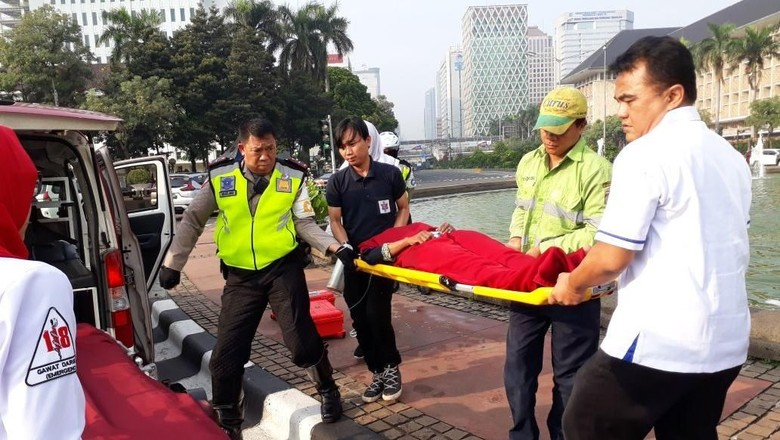

Seorang wanita bernama Siti Maya (41) diamankan petugas Suku Dinas Sosial Jakarta Pusat. Petugas Dinsos mendapatkan kabar Maya hendak bunuh diri di kolam Patung Kuda, yang ada di kawasan Monas.

"Jadi anggota mendapatkan laporan dari anggota Dishub yang bertugas, katanya ada perempuan diduga depresi dan ingin bunuh diri di area Patung Kuda. Setelah itu, kita cek ke lokasi. Lalu dibawa ke RS cek luka," kata staf Seksi Rehabilitasi Sosial Sudinsos Jakpus, Dicky Setiawan, saat dihubungi, Senin (28/5/2018).

Peristiwa itu terjadi pada hari ini. Maya dibawa ke RS Budi Kemuliaan. Setelah dicek, tak ditemukan luka serius pada tubuh Maya.

Siti Maya dibawa petugas Dinsos ke PSBI Kedoya setelah diperiksa di RS Budi KemulyaanSiti Maya dibawa petugas Dinsos ke PSBI Kedoya setelah diperiksa di RS Budi Kemuliaan. (Foto: Dok. Dinas Sosial DKI Jakarta)

Setelah itu, petugas Dinsos mewawancarai Maya. Kepada petugas, Maya mengaku terpeleset di kolam Patung Kuda saat ingin buang air kecil.

"Dia mengaku ingin buang air kecil, lalu terpeleset. Tapi waktu diwawancara dia kooperatif aja. Kalau ditanya, dia jawab. Dan dia normal saja, tak ada mengucap mau mati, mau mati," ucap Dicky.

Maya kemudian dibawa ke Panti Sosial Bina Insan (PSBI) Bangun Daya 1 di Kedoya, Jakarta Barat. Maya akan di-assessment juga di PSBI Kedoya.

"Kita bawa ke PSBI Kedoya nanti di-assessment lagi di sana. Dia sempat marah karena ditanya-tanya terus. Jadi saya minta anggota setop tanya biar dia (Maya) tetap kooperatif saat dibawa," ujarnya.