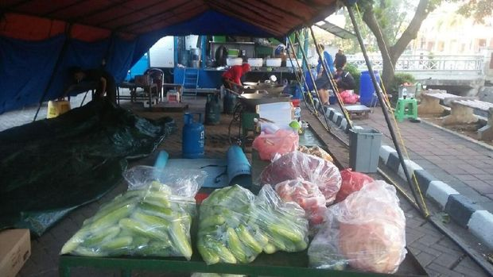

Suku Dinas Sosial Jakarta Barat membuat dapur umum di lokasi kebakaran Taman Kota, Jakarta Barat. Ada sebanyak 1.500 boks makanan yang didistribusikan kepada korban terdampak kebakaran.

"Ketika ada kabar terjadi kebakaran, Tim PSKB kami segera menyiapkan bantuan sementara. Dalam SOP kami 2 jam response time bantuan sudah diberikan," kata Kepala Suku Dinas Sosial Jakarta Barat, Surya lewat keterangan tertulis yang diterima, Jumat (30/3/2018).

Warga ikut memasak di dapur umum untuk korban kebakaran Taman KotaWarga ikut memasak di dapur umum untuk korban kebakaran Taman Kota (Foto: Dok. Dinsos DKI)

Baca juga: Imbas Kebakaran di Taman Kota, 4 Mobil 'Meleleh'

Makanan tersebut dibagikan Petugas Sosial Kesiapsiagaan Bencana (PSKB) dari Taruna Siaga Bencana (Tagana) Suku Dinas Sosial Kota Administrasi Jakarta Barat. Dapur umum ini sendiri akan dioperasikan minimal 3 hari ke depan.

Saat ini juga didistribusikan bantuan berupa mi instan 60 dus, selimut 100 lembar, matras 60 lembar, terpal 50 lembar, dan celana dalam 200 buah. Petugas juga telah mendirikan tenda pengungsian untuk para korban.

Baca juga: Cerita Warga: Kebakaran di Taman Kota Diawali Sambaran Petir

Logistik untuk korban kebakaran Taman KotaLogistik untuk korban kebakaran Taman Kota (Foto: Dok. Dinsos DKI)

Cepatnya bantuan yang terdistribusi ini tak terlepas dari terbentuknya Kampung Siaga Bencana (KSB). Kampung ini dikelola warga namun bahan logistik berasal dari Dinas Sosial.

Kebakaran terjadi di Jalan Perumahan Taman Kota Blok A1, Kembangan, Jakarta Barat, pada Kamis (29/3) malam. Sebanyak 22 unit mobil pemadam kebakaran dikerahkan hingga akhirnya api dapat dipadamkan pada dini hari tadi. Ada sebanyak 2 orang yang jadi korban jiwa dari peristiwa ini.